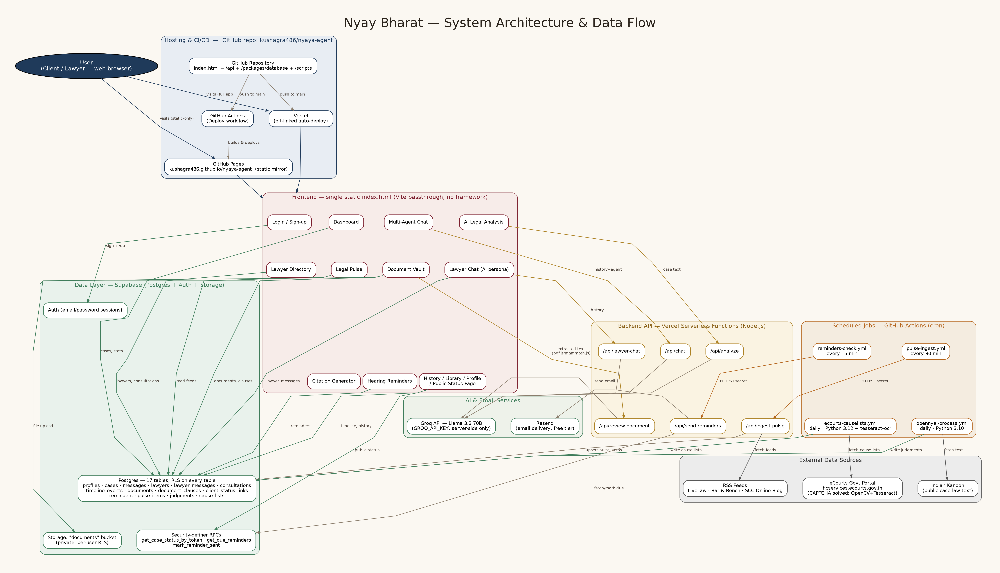

<div align="center">


# Nyay Bharat
### India's AI Legal Intelligence Platform

**by [kushagra486](https://github.com/kushagra486)**

Bridging the gap between India's old criminal codes (IPC · CrPC · Indian Evidence Act)
and the new ones (BNS · BNSS · BSA) — with AI-assisted research, drafting,
document review, and lawyer discovery, in a single zero-cost, open-source stack.

[](./LICENSE)
[](./CHANGELOG.md)
[](#-live-app)
[](#%EF%B8%8F-tech-stack)

**[Live App](https://nyaya-agent-git-main-kushagra486s-projects.vercel.app)** · **[Static Mirror](https://kushagra486.github.io/nyaya-agent/)** · **[Changelog](./CHANGELOG.md)** · **[Architecture Diagram](./docs/architecture.png)**

</div>

<br/>

## Table of Contents

- [Overview](#overview)
- [Live App](#-live-app)
- [Features](#-features)
- [Architecture](#-architecture)
- [Tech Stack](#%EF%B8%8F-tech-stack)
- [Database Schema](#-database-schema)
- [Frontend & UI Design System](#-frontend--ui-design-system)
- [Backend](#-backend)
- [Workflows](#-workflows)
- [Repository Structure](#-repository-structure)
- [Getting Started](#-getting-started)
- [Environment Variables & Secrets](#-environment-variables--secrets)
- [Versioning](#-versioning)
- [Roadmap](#-roadmap)
- [Security](#-security)
- [Contributing](#-contributing)
- [License](#-license)

<br/>

## Overview

On **1 July 2024**, India replaced its colonial-era criminal codes with three
new ones — the **Bharatiya Nyaya Sanhita (BNS)**, **Bharatiya Nagarik Suraksha
Sanhita (BNSS)**, and **Bharatiya Sakshya Adhiniyam (BSA)** — renumbering and
rewriting the law that governs over a billion people. Lawyers, students,
police, and ordinary citizens are all still translating between the old
section numbers and the new ones.

**Nyay Bharat** is an AI-native legal platform built to make that transition
legible: a single citizen or advocate can describe a situation in plain
language (in English, Hindi, Marathi, or Tamil) and get back the current,
correct statute — not the repealed one — along with next steps, document
review, a lawyer directory, and a live feed of legal news and court activity.

Every piece of it runs on **free-tier infrastructure**: Supabase, Vercel,
GitHub Pages, and GitHub Actions. No servers to pay for, no infrastructure
bill, fully open-source.

<br/>

## 🚀 Live App

| | |
|---|---|
| **Primary (full app + AI features)** | https://nyaya-agent-git-main-kushagra486s-projects.vercel.app |
| **Static mirror (GitHub Pages)** | https://kushagra486.github.io/nyaya-agent/ |
| **Mobile app** | Flutter source in [`apps/mobile`](./apps/mobile) — Android/iOS, same backend |

<br/>

## ✨ Features

<table>
<tr><td width="50%" valign="top">

**Case Intelligence**
- 🔍 AI Legal Analysis — facts, current-law statutes, next steps
- 📅 Case Timeline — auto-extracted chronology + manual events
- 🤖 Multi-Agent Chat — Research · Drafting · Compliance agents
- 📄 Citation Generator — SCC/AIR-style, pure deterministic formatting

**Documents**
- 📁 Document Vault — upload PDF/DOCX
- ⚠️ Clause-level AI risk review (low/medium/high)

</td><td width="50%" valign="top">

**People**
- ⚖️ Lawyer Directory — 20 lawyers, every major specialization
- 💬 Lawyer Chat — AI-simulated persona replies (clearly disclosed demo mode)
- 🔗 Client Status Page — shareable read-only link, zero login

**Access & Ops**
- 🌐 Multilingual UI + AI replies — English · Hindi · Marathi · Tamil
- 🌓 Dark / light theme toggle
- 📧 Hearing Reminders — email, 1 day before
- 📰 Legal Pulse — live RSS feed + trending + structured judgments + eCourts cause lists

</td></tr>
</table>

<br/>

## 🏗 Architecture

<div align="center">

</div>

The full-resolution diagram (with every data flow labeled) is at
[`docs/architecture.png`](./docs/architecture.png) ·
[SVG source](./docs/architecture.svg) ·
[Graphviz source](./docs/architecture.dot).

**In short:**
- The **entire frontend is a single static `index.html`** — no build step, no framework, no bundler dependency at runtime. Vite passes it through unchanged so it deploys identically on Vercel and GitHub Pages.
- The frontend talks to **Supabase directly** (via `@supabase/supabase-js`) for everything data-related — auth, cases, chat history, lawyers, documents. Row-Level Security on every table is what actually enforces access control, not the frontend.
- The frontend talks to a small set of **Vercel serverless functions** only for AI calls (analysis, chat, lawyer persona, document review) — this is the only place the Groq API key exists, server-side, never shipped to the browser.
- **GitHub Actions runs four independent scheduled jobs** — RSS ingestion, email reminders, OpenNyAI judgment structuring (Python), and eCourts cause-list scraping (Python, with genuine automated CAPTCHA-solving) — each writing straight to Supabase.

<br/>

## 🛠️ Tech Stack

| Layer | Technology | Why |
|---|---|---|
| Frontend | Vanilla HTML/CSS/JS (single file) | Zero build tooling, identical output on every host |
| Hosting | Vercel + GitHub Pages | Both free, git-linked auto-deploy |
| Backend compute | Vercel Serverless Functions (Node.js) | Free tier, scales to zero |
| Database | Supabase (Postgres + pgvector) | Free tier, Row-Level Security, Realtime-ready |
| Auth | Supabase Auth | Email/password, built-in |
| File storage | Supabase Storage | Private per-user bucket |
| AI inference | Groq — Llama 3.3 70B | Free/cheap, fast inference |
| Email | Resend | Free tier, no card required |
| Scheduling | GitHub Actions (cron) | Free (unlimited on public repos) |
| Document parsing | pdf.js, mammoth.js | Client-side, no server cost |
| Judgment NLP | OpenNyAI (Python) | Purpose-built Indian legal NLP models |
| eCourts scraping | `openjustice-in/ecourts` (Python) | Real, published, automated CAPTCHA solver |
| Mobile | Flutter | Single codebase, same backend |

<br/>

## 🗄 Database Schema

17 tables in Supabase Postgres, **Row-Level Security enabled on every single one** —
owner-scoped for personal data, public-read for shared content (lawyer
directory, legal news feed), and security-definer RPC functions for the two
places an unauthenticated caller needs narrow, controlled access (the public
case-status page, and the reminders cron job).

<details>
<summary><b>Click to expand full table list</b></summary>

| Table | Purpose |
|---|---|
| `profiles` | User profile, auto-created on sign-up (name, email) |
| `cases` | A user's legal matter — description, AI analysis, hearing date |
| `messages` | Case-agent chat, tagged by agent type (research/drafting/compliance) |
| `timeline_events` | Chronology per case — AI-extracted + user-added |
| `lawyers` | Directory of 20 lawyers across every specialization |
| `lawyer_messages` | Direct chat thread between a user and a specific lawyer |
| `consultations` | Consultation requests linking a case to a lawyer |
| `documents` / `document_clauses` | Uploaded files + their AI clause-risk review |
| `client_status_links` | Shareable, tokenized, read-only case status links |
| `reminders` | Scheduled hearing-date email reminders |
| `pulse_items` | RSS-aggregated legal news (LiveLaw, Bar & Bench, SCC Online Blog) |
| `judgments` | OpenNyAI-structured judgment summaries (NER, rhetorical roles) |
| `cause_lists` | eCourts-fetched daily cause lists per court |

</details>

Full SQL: [`packages/database/schema.sql`](./packages/database/schema.sql) +
9 incremental migrations in the same folder (or the combined
[`migration_combined_remaining.sql`](./packages/database/migration_combined_remaining.sql)).

<br/>

## 🎨 Frontend & UI Design System

**Typography**
| Role | Font |
|---|---|
| Headings | [Fraunces](https://fonts.google.com/specimen/Fraunces) (serif, warm, editorial) |
| Body & UI | [Inter](https://fonts.google.com/specimen/Inter) |
| Data / citations / stats | [IBM Plex Mono](https://fonts.google.com/specimen/IBM+Plex+Mono) |

**Color palette** — light theme (default is dark; both fully supported and toggleable):

| Token | Hex | Used for |
|---|---|---|
| `--bg` | `#f6f1e6` | Page background (warm cream, not stark white) |
| `--ink` | `#2a231b` | Primary text |
| `--maroon` | `#7c1f2e` | Primary accent — CTAs, links, active states |
| `--navy` | `#1f3a5a` | Secondary accent |
| `--gold` | `#ad8225` | Tertiary accent — highlights, stat numbers |
| `--mint` | `#3f7d5b` | Success / verified states |
| `--error` | `#a63333` | Error states |

**Contrast (WCAG 2.1), measured, not assumed:**

| Pair | Ratio | Rating |
|---|---|---|
| Body text on background (light) | **13.76 : 1** | AAA |
| Body text on background (dark) | **15.59 : 1** | AAA |
| Maroon accent on background (light) | **8.91 : 1** | AAA |
| White text on maroon button | **10.04 : 1** | AAA |
| Secondary/muted text on background | **3.56–6.83 : 1** | AA (large text) |

Every primary text/background combination clears **WCAG AAA**; secondary
(de-emphasized) text clears AA for large text, which is the correct target
for supporting copy rather than body content.

**Design principles applied:**
- Warm, editorial tone (serif headings, cream paper background) rather than
  a generic SaaS-blue look — deliberately chosen to feel like a considered
  legal publication, not a template.
- Every AI-generated surface carries a persistent, non-dismissable disclaimer
  — this isn't cosmetic, it's a legal-safety requirement given the subject
  matter.
- Mobile-first responsive layout with a real hamburger-menu drawer (a bug
  found and fixed twice in this project's history — see [CHANGELOG](./CHANGELOG.md) v0.7.0).

<br/>

## ⚙️ Backend

No separate backend server — **Vercel Serverless Functions** (Node.js,
`apps/web/api/*.js`) handle only the calls that need a hidden API key:

| Function | Purpose |
|---|---|
| `analyze.js` | Case → structured facts/statutes/steps/timeline JSON |
| `chat.js` | Multi-agent case chat (research/drafting/compliance), locale-aware |
| `lawyer-chat.js` | AI-simulated lawyer persona replies |
| `review-document.js` | Clause-by-clause document risk review |
| `ingest-pulse.js` | RSS → `pulse_items` (called by a scheduled GitHub Action) |
| `send-reminders.js` | Due-reminder check → Resend email (called by a scheduled GitHub Action) |

All six share the same pattern: **the Groq/Resend keys live only in Vercel's
server-side environment variables** — never in source control, never sent to
the browser. Per-IP rate limiting on every AI endpoint.

Two **Python scripts** (`scripts/*.py`) run outside Vercel entirely, directly
inside scheduled GitHub Actions VMs, since they need a real Python ML/scraping
runtime that serverless Node functions can't provide — see
[Architecture](#-architecture).

<br/>

## 🔄 Workflows

### User workflow
```
Sign up (email + password + full name)
   → Dashboard: create a case (describe it, or upload a document)
   → AI Legal Analysis: get current-law statutes + suggested steps
   → Chat with an agent (Research/Drafting/Compliance) for follow-ups
   → Find a Lawyer → message one directly, or request a paid consultation
   → Set a hearing date → get an email reminder the day before
   → Share a read-only status link with family/co-counsel, no login needed
```

### Data workflow
```
Browser  ──(direct, RLS-enforced)──▶  Supabase (auth, cases, chat, lawyers, files)
Browser  ──(AI calls only)────────▶  Vercel Functions  ──▶  Groq / Resend
GitHub Actions (cron, 4 jobs)  ────▶  RSS feeds / Indian Kanoon / eCourts portal
                                 └──▶  writes results into Supabase
```

### CI/CD workflow
```
git push main
   ├──▶ GitHub Actions "Deploy" workflow ──▶ GitHub Pages (static mirror)
   └──▶ Vercel (git-linked)              ──▶ Production deploy (full app)
```
Both deploy automatically, in parallel, on every push — no manual deploy step
ever required.

<br/>

## 📁 Repository Structure

```
nyaya-agent/
├── apps/
│   ├── web/                    # The whole web app
│   │   ├── index.html          #   Single-file frontend (no build step)
│   │   ├── api/                #   6 Vercel serverless functions
│   │   └── versions/           #   Every tagged release, browsable standalone
│   └── mobile/                 # Flutter app (Android/iOS)
├── packages/
│   ├── database/                # schema.sql + 9 migrations
│   └── legal-data/               # IPC/CrPC/Evidence Act ↔ BNS/BNSS/BSA mapping data
├── scripts/                     # Python jobs (OpenNyAI, eCourts) — run via GitHub Actions
├── docs/
│   ├── architecture.{png,svg,dot}
│   └── assets/logo.png
├── .github/workflows/            # 4 CI/CD + cron workflows
└── CHANGELOG.md                  # Full version history, v0.1.0 → v1.5.1
```

<br/>

## 🚦 Getting Started

**Just want to look at the app?** Open the [live link](#-live-app) — nothing to install.

**Run it locally:**
```bash
git clone https://github.com/kushagra486/nyaya-agent.git
cd nyaya-agent/apps/web
# It's a single static file - just open it:
open index.html
# Or, to also test the /api serverless functions locally:
npm install -g vercel
vercel dev
```

**Set up your own backend** (optional — the app already points at a live
Supabase project):
1. Create a free [Supabase](https://supabase.com) project
2. Run `packages/database/schema.sql`, then every `migration_*.sql` in order
   (or the single [combined file](./packages/database/migration_combined_remaining.sql))
3. Update the Supabase URL/anon key in `apps/web/index.html`
4. Deploy `apps/web` to Vercel, add the environment variables below

<br/>

## 🔑 Environment Variables & Secrets

Set these in **Vercel → Project Settings → Environment Variables**:

| Variable | Used by | Required for |
|---|---|---|
| `GROQ_API_KEY` | All 4 AI serverless functions | Analysis, Chat, Lawyer Chat, Document review |
| `RESEND_API_KEY` | `send-reminders.js` | Hearing reminder emails |
| `INGEST_SECRET` | `ingest-pulse.js`, `send-reminders.js` | Blocks public internet from triggering these write endpoints |

Set `INGEST_SECRET` a second time as a **GitHub Actions repo secret**
(Settings → Secrets and variables → Actions) with the identical value.

<br/>

## 🏷 Versioning

Every release from **v0.1.0 to v1.5.1** is git-tagged, changelogged, and
individually browsable:

- Full history: [`CHANGELOG.md`](./CHANGELOG.md)
- Browsable snapshots: [`apps/web/versions/`](./apps/web/versions) — open any
  `.html` file directly, no build step
- `git tag -l` for the complete tag list, `git checkout vX.Y.Z` to jump to any
  exact version

<br/>

## 🗺 Roadmap

| Item | Status |
|---|---|
| Case Timeline, Multi-Agent Chat, Citation Generator, Document Vault, Multilingual, Client Status Page, Hearing Reminders | ✅ Shipped |
| Legal Pulse — RSS + trending | ✅ Shipped |
| OpenNyAI judgment structuring | ✅ Shipped (via Indian Kanoon, not eCourts) |
| eCourts cause lists | ✅ Shipped (3 High Courts seeded; real CAPTCHA-solving) |
| Lawyer Chat + expanded roster | ✅ Shipped |
| Real payment for consultations | ⏳ Planned |
| Real lawyer onboarding (not AI-simulated) | ⏳ Planned |
| Push notifications | ⏳ Planned |
| Video consultations | ⏳ Planned |
| Automated test suite | ⏳ Planned |

<br/>

## 🔒 Security

- Row-Level Security enforced on **every** table — the frontend's Supabase
  anon key has no special privileges beyond what RLS grants per-user.
- No `service_role` key is used **anywhere** in this project, by design.
- API keys (Groq, Resend) live only in Vercel's server-side environment,
  never in source, never sent to the browser.
- Write-capable cron endpoints (`ingest-pulse`, `send-reminders`) are
  protected by a shared secret, not left open to the public internet.
- Found an issue? Please open a GitHub issue rather than a public PR for
  anything security-sensitive.

<br/>

## 🤝 Contributing

Issues and PRs welcome. This project intentionally stays on a zero-cost
stack — if you're proposing a new dependency, a free-tier equivalent is
strongly preferred over a paid one.

<br/>

## 📄 License

MIT — see [LICENSE](./LICENSE).

<div align="center">
<sub>Built by <a href="https://github.com/kushagra486">kushagra486</a> · Not affiliated with the Government of India or the Bar Council of India.</sub>
</div>
